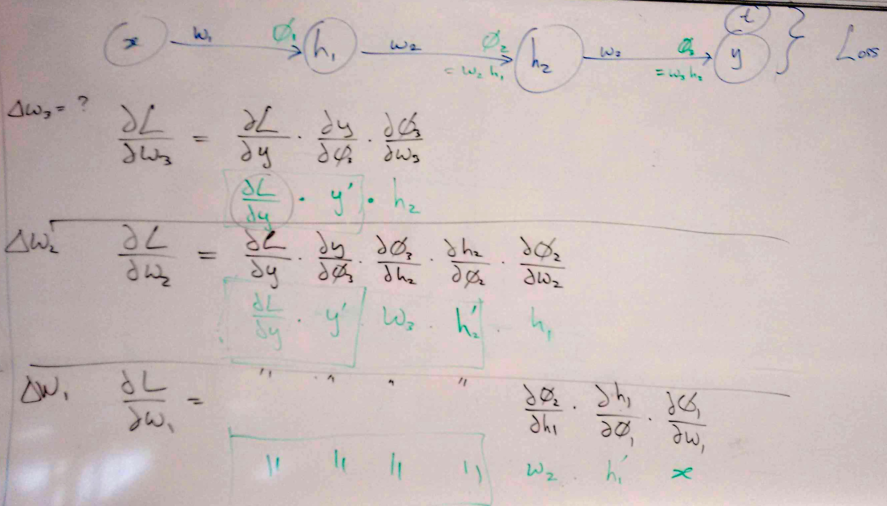

# back-propagation

## Lecture :five: (Thursday, week 2)

#### the softmax activation function, and cross-entropy loss
We discussed softmax and cross-entropy this lecture, but I've put them at the end of the [preliminaries](../preliminaries) we've covered up to now, as that seems a better place.

#### back-propagation

* the work-horse of all neural network learning
* See Marsland Chapter 4.

The simplest example: just a chain of "neurons" (ie. weighted multiplications followed by fixed non-linearities).

We considered an example of a neural net with one neuron per layer, and layers of weights, ie. 
   * $`x \longrightarrow h_1(\phi_1)  \longrightarrow h_2(\phi_2) \longrightarrow y(\phi_3)    `$ with weights $`w_1, w_2, w_3 `$ from each layer to the next.
   * $`\phi_1 = w_1 x, \phi_2 = w_2 h1, \phi_3 = w_3 h_2 `$, and each of $`h_1, h_2, y`$ is some function of the associated $`\phi`$.
   * at the "end" there's a comparison between output $`y`$ and target $`t`$, which is what we call the Loss Function, which is something that's added up over the whole training set. And of course that's going to be a function of all the weights: $`\mathcal{L} = \mathcal{L}(w_1, w_2, w_3)`$

Now, to be totally verbose about it, consider trying to learn each of those weights - our method will be gradient descent of the loss function, so we want to find that gradient (for each pair of inputs $`(x,t)`$ in the training set).
   * how to change weight $`w_3`$ in the final layer? Just using the chain rule:   

$`\frac{\partial\mathcal{L}}{\partial w_3} = \frac{\partial\mathcal{L}}{\partial y} \cdot \frac{\partial y}{\partial \phi_3} \cdot \frac{\partial \phi_3}{\partial w_3} `$

   * how to change weight $`w_2`$ in the layer before that? Again, just using the chain rule:

$`\frac{\partial\mathcal{L}}{\partial w_2} = \frac{\partial\mathcal{L}}{\partial y} \cdot \frac{\partial y}{\partial \phi_3} \cdot \frac{\partial \phi_3}{\partial h_2} \cdot \frac{\partial h_2}{\partial \phi_2} \cdot \frac{\partial \phi_2}{\partial w_2} `$

   * how to change weight $`w_1`$ in the first layer? Again...
   
$`\frac{\partial\mathcal{L}}{\partial w_2} = \frac{\partial\mathcal{L}}{\partial y} \cdot \frac{\partial y}{\partial \phi_3} \cdot \frac{\partial \phi_3}{\partial h_2} \cdot \frac{\partial h_2}{\partial \phi_2} \cdot \frac{\partial \phi_2}{\partial h_1} \cdot \frac{\partial h_1}{\partial \phi_1} \cdot \frac{\partial \phi_1}{\partial x} `$

Notice how all the leading terms just recur - more and more of them. This suggests we could calculate them once, and reuse the results. And this is the essence of "back-propagation".

* better: matrix $`\longrightarrow`$ non-linearity $`\rightarrow`$  matrix $`\longrightarrow`$ non-linearity $`\rightarrow`$ matrix $`\longrightarrow`$ non-linearity $`\rightarrow`$ output ...$`\rightarrow`$ loss function. The fact that we have layers with more than one neuron in them complicates things a little (e.g. the weights in the above become matrices of weights), _however not by that much_. The essential of back-prop is simply the chain rule of differential calculus: if $`f = f(g)`$ and $`g = g(h)`$ then 
$`\frac{\partial f}{\partial h} = \frac{\partial f}{\partial g}  \cdot \frac{\partial g}{\partial h} `$

## Lecture :six: (Friday, week 2)

Everyone:

 * [install anaconda, so that we can use jupyter notebook](http://jupyter.readthedocs.io/en/latest/install.html)
 * Get stuck into [exercise 2](../exercises), for Tuesday.
 * If this is too tight a turnaround, do let me know...
 * ...via your *Class Rep* :sunny:

* FIRST: a thought about softmax. `softmax` with just 2 classes ought to be "same" as sigmoid in some sense, right? Right.

Continuing to think about backpropagation:
* what do (weights) matrices _do_ ?
* why have non-linearities at all?
* neural nets are linear matrix multiplies interspersed with element-wise non-linearities
* what does that allow? (any single-valued function).
* what are suitable non-linearities?
  * nothing / identity (ie. linear)
  * sigmoid (for outputs that are binary, ie. 2 categories)
  * softmax (for outputs that are _categorical_ with more than 2 categories
  * ReLU : rectified linear units (used in state-of-the-art networks now)
* think about the gradient, in a network with ReLUs!
* discussion

## Lecture :seven: (Tuesday, week 3)

* review / mark [exercise 2](../exercises/ex2.md)
* Radial Basis Functions
   * an alternative to neural nets
   * shallow (2 layers)
   * instead of hidden units computing a non-linear function of $`\phi=\mathbf{x}\cdot\mathbf{w} + w_\text{bias}`$, they compute a non-linear function of the Euclidean distance between their weights vector and the input vector, $`r=\sqrt{\|\mathbf{x}-\mathbf{w}\|^2}`$, hence _radial_ basis function. 
   * the non-linearity _could_ be (say) $`\exp(-r^2/2)`$, which fades to zero at large $`r`$. But it has been shown that even _increasing_ functions can perform well in practice, such as $`r^2 \log r`$
   * _could_ train whole thing by backprop, but there's a *quicker, hybrid way*:
   * Layer 2 is regular perceptron learning, or softmax, or regression... easy as it's just the final layer 
   * Layer 1 could be k-means, or similar, ie. not directly driven by the actual loss function at all
   * but that's an issue - e.g. the _optimal_ features for that 2nd layer classifier might _actually depend on what the classification problem is_ :astonished-face:
   * not widely used, but worth knowing about
   
<!--
* discussion of alternatives to Backprop and neural nets:
1. Polynomials and splines
2. Radial basis function nets
-->
